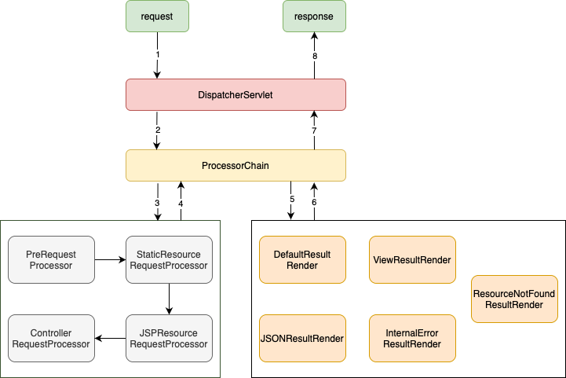

# AIM-framework

AIM, an abbreviation of **A**OP + **I**OC + **M**VC, is a light-weighted framework which provides AOP and IOC support for your Java project.
AIM also encapsulates an MVC framework which is built around a DispatcherServlet. The mvc framework inside AIM is completely integrated with 
the IOC and AOP support provided by the framework.

## Highlights

#### IOC

✅ Method level dependency injection\
✅ Resolve circular dependency

#### AOP

✅ Support both JDK and CGlib dynamic proxy\
✅ Support four different kinds of advice

#### MVC

✅ Binding request parameter/body/URI template variable to method parameters\
✅ Different result rendering mechanisms

####

## AIM capabilities

### Bean Container

BeanContainer is the core container of AIM framework, and it is responsible for instantiating, assembling and managing 
the beans annotated by the following annotations:```@Component```, ```@Controller```,```@Service```,```@Repository```,```@Aspect```

### IOC
AIM supports method level dependency injection as shown below with the help of ```@Autowired``` annotation. Inorder to resolve
possible ambiguity, user could specify the name of the bean to be injected in the ```@Autowired``` annotation. 

```java
import com.aim.core.annotation.Component;
import com.aim.ioc.annotation.Autowired;

@Component
public class BeanA {
    BeanB beanB;

    @Autowired
    public void setBeanB(BeanB bean) {
        this.beanB = bean;
    }
}
```

### AOP

AIM supports two kinds of dynamic proxy mechanism, JDK dynamic proxy and CGlib dynamic proxy. JDK dynamic proxy will be
applied only when the proxied class implements at least one interface. Otherwise, CGlib dynamic proxy will be used.

A class annotated with ```@Aspect``` is considered as an aspect class. Advices can be declared in such class with the following annotations:
```@Before```,```@After```,```@AfterReturning```,```@AfterThrowing```.

```java

import com.aim.aop.annotation.AfterReturning;
import com.aim.aop.annotation.Aspect;

@Aspect
public class Aspect1 {
    @Before(Time.class)
    public void beforeAdvice() {
        ...
    }

    @AfterReturning(Time.class)
    public Object afterReturningAdvice() {
        ...
    }
}
```

Point cut in AIM is declared as custom annotation created by the user and it is needed when declaring an Advice.

```java
@Target(ElementType.METHOD)
@Retention(RetentionPolicy.RUNTIME)
public @interface Time {
}

```

```java
import com.aim.core.annotation.Component;
import com.example.mvc.aspect.annotation.Time;

@Component
public class component1 {
    
    @Time // Join Point
    public void method1() {
        ...
    }
} 
```

In case of having multiple aspects applied to the same join point, ```@Order``` annotation can be used above aspect class to specify the ordering
of each aspect with smaller number having higher priority.

```java
import com.aim.aop.annotation.Aspect;
import com.aim.aop.annotation.Order;

@Aspect
@Order(1)
public class Aspect1{}
```

### MVC

The high-level request processing workflow is shown below.



The DispatcherServlet is, by default, mapped to url pattern ```/*```. Any incoming request will be received by the DispatcherServlet first and then handed over the processor chain.

PreRequestProcessor is in charge of setting the encoding for request and formatting the request path info.

Any request asking for static resources and JSP templates will be processed by either StaticResourceRequestProcessor or JSPResourceRequestProcessor. These two kinds of request will be handed over
to the default servlet of tomcat.

ControllerRequestProcessor in which contains registry of all controllers handles all requests toward non-static resources.

A class annotated with ```@Controller``` is considered as a controller class. User can add ```@RequestMapping``` to the class which
indicates the url mapping to this controller.

```java
import com.aim.core.annotation.Controller;
import com.aim.mvc.annotation.RequestMapping;

@Controller
@RequestMapping("/url")
public class Controller1 {
}
```

```@RequestMapping``` can also be used to annotate methods inside a controller. The url mapping to certain method will be the concatenation
of the url in class level annotation and method level annotation. If the class level ```@RequestMapping``` is omitted, onyl method level annotation
will be considered.

```java
import com.aim.core.annotation.Controller;
import com.aim.mvc.annotation.RequestMapping;
import com.aim.mvc.type.RequestMethod;

@Controller
@RequestMapping("/class-level-url")
public class Controller2 {
    @RequestMapping(value = "/method-level-url", method = RequestMethod.GET)
    public void method1(){
        ...
    }
}
```

Request parameters, HTTP request body and URI template variables can be automatically bind to method parameters using following annotations:
```@RequestParam```,```@RequestBody```,```@PathVariable```

```java
import com.aim.core.annotation.Controller;
import com.aim.mvc.annotation.PathVariable;
import com.aim.mvc.annotation.RequestBody;
import com.aim.mvc.annotation.RequestMapping;
import com.aim.mvc.annotation.RequestParam;
import com.aim.mvc.type.RequestMethod;

@Controller
@RequestMapping("/class-level-url")
public class Controller3 {
    @RequestMapping(value = "/method-level-url1", method = RequestMethod.POST)
    public void method1(@RequestParam("email") String email) {
        ...
    }

    @RequestMapping(value = "/method-level-url2", method = RequestMethod.POST)
    public void method2(@RequestBody User user) {
        ...
    }

    @RequestMapping(value = "/method-level-url3/{id}/{email}",method = POST)
    public void method3(@PathVariable("id") String id, @PathVariable("email") String email) {
        ...
    }
}
```

Result rendering is determined by following:

**occurrence of exception**\
When exception occurs, either InternalErrorResultRender or ResourceNotFoundResultRender will be used to render the result.
Processor chain will determine which one to use based on the type of exception.

**return value of the method being called in controller**\
DefaultResultRender will be used if the return type is void. When the return type is ModelAndView or String, ViewResultRender
will be used to render the result

**annotation above the method being called in controller**\
If the method being called is annotated with ```@ResponseBody```, it means that the front end expects the result to be in JSON format.
JSONResultRender will convert the return value to JSON string and write it to the response.

All functionalities of IOC and AOP mentioned above are available.